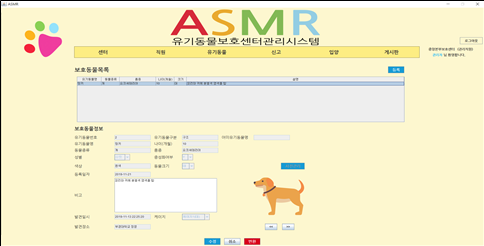

# 2019 캡스톤 디자인

### :iphone: 서비스 기획내용
서비스명: ASMR(Animal Shelter Management and Rescue)

#### :bulb: 서비스 아이디어
> 증가하는 유기동물들에 대한 구조/보호 및 유기동물의 반환 및 입양을 위한 유기동물보호센터 시스템 구축

#### :grey_question: 서비스 제안 배경
* 현재 우리나라는 핵가족화와 1인 가구가 증가로 인한 반려동물의 수 증가와 동시에 급격한 유기동물의 수 증가
* 유기동물의 발생으로 인한 피해도 사회적인 문제 대두
	- 인수공통 전염병
	- 도심 쓰레기
	- 생활 소음

#### :clipboard: 서비스 디테일
* 시스템을 사용하는 직원과 고객을 관리
* 유기동물보호센터 관리 
* 유기동물들을 관리하기 위해 사용자들이 보호센터와 상호작용하는 신고, 배정, 구조, 보호, 진료, 반환, 공고, 입양, 사후관리

#### :moneybag: 서비스 기대효과
* 서비스 이용 고객 및 유기동물에 대한 체계적인 관리
* 유기동물로 인해 발생하는 사회적 문제 감소
* 유기동물 입양 문화 인식 제고

### :earth_asia: 개발환경

#### :octocat: 개발언어
 - java (swing, awt, javaFX)

#### :computer: DB
 - Oracle 11g

#### :wrench: Tool
 - Eclipse Jee 2019-03
 - DA#4 Modeler
 - DA#4 Wordict
 - Oracle sqldeveloper

#### :checkered_flag: DA 설계 결과물
 1. 요구사항명세서
 2. 업무정의서
 3. 엔터티정의서
 4. 속성정의서
 5. 관계정의서
 6. 논리데이터모델
	
 7. 단어사전
 8. 도메인사전
 9. 용어사전
 10. 물리데이터모델
	
 11. 테이블정의서
 12. 인덱스정의서
 13. 데이터삽입결과

### :globe_with_meridians: UI

